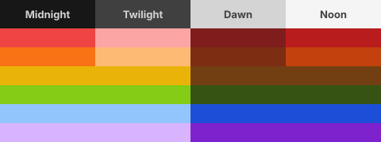
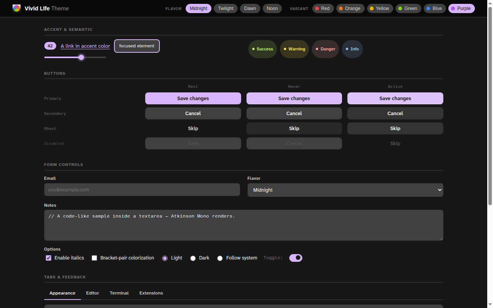
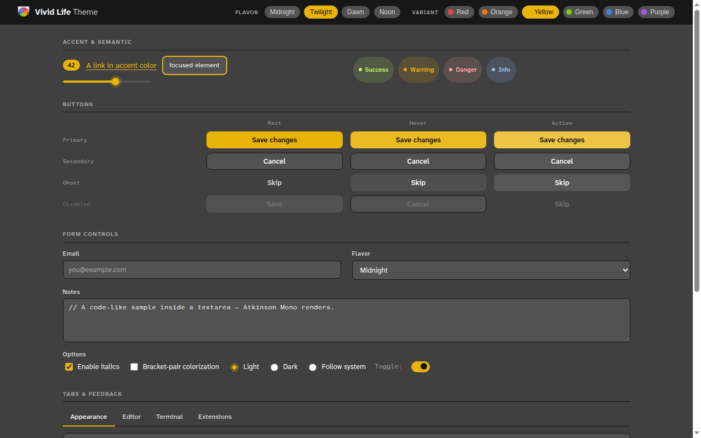
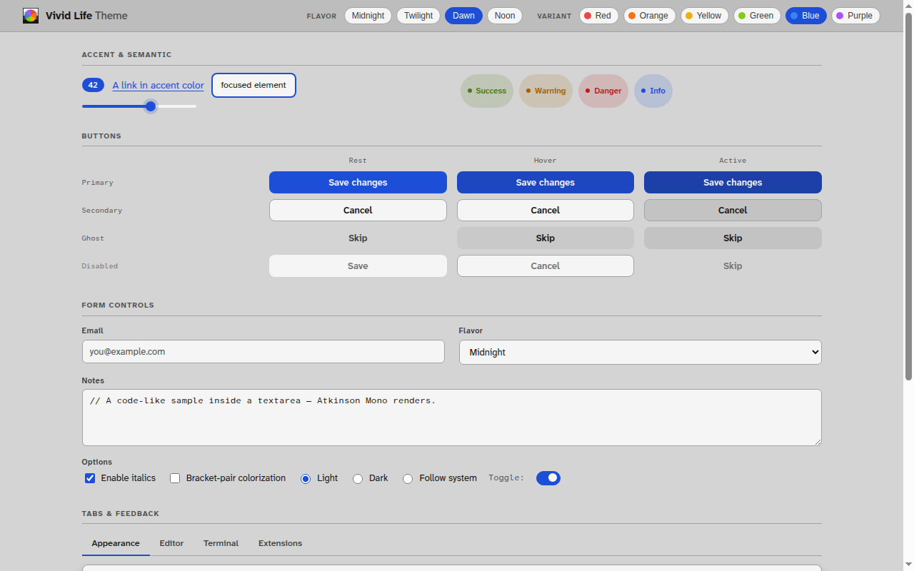
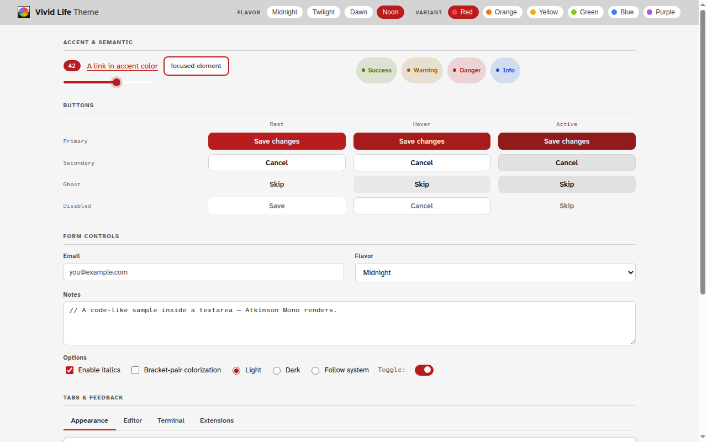
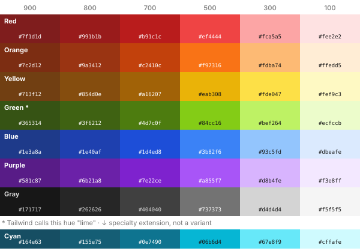
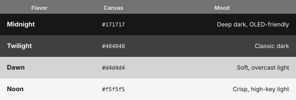
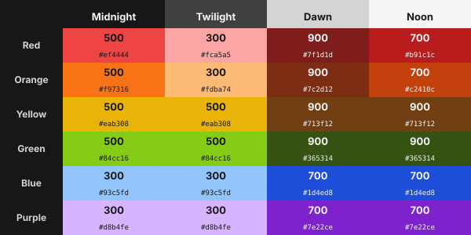

<p align="center">
  <picture>
    <source media="(prefers-color-scheme: dark)" srcset="assets/wordmark-dark.svg" />
    
  </picture><br>
  Design System
</p>
<p align="center">
  
  
  
  
</p>

> A multi-flavor color scheme system. 4 flavors × 6 variants = 24 themes. WCAG AA verified.

This repository is the **foundation** for a family of themes. It is not itself a theme for any one app. Downstream projects — VS Code, GTK, websites, future ports — read their colors, type, spacing, and component rules from **this** project and emit native theme files.

```txt
   THIS REPO                                  DOWNSTREAM PORTS
   ─────────                                  ────────────────
   tokens.json5  (single source of truth)
        │
        ├── tokens.json                       vivid-life-vscode
        ├── dist/tokens.js                    vivid-life-gtk
        ├── colors_and_type.css               vivid-life-web      …
        ├── fonts/
        └── assets/
```

Every port is its own GitHub repo and (potentially) its own Claude Code project. **If a port needs a color, type, or spacing value not defined here, that's a foundation gap** — fix it here, regenerate, and the port re-reads.

<br />

<p align="center">
  
</p>

<p align="center"><sub>4 flavors × 6 variants = 24 themes · all WCAG AA</sub></p>

---

## Contents

- [Contents](#contents)
- [Features](#features)
- [Preview](#preview)
- [The system at a glance](#the-system-at-a-glance)
  - [Source palette](#source-palette)
  - [4 flavors (= 4 syntax color schemes)](#4-flavors--4-syntax-color-schemes)
  - [6 accent variants (per flavor)](#6-accent-variants-per-flavor)
  - [Accent-shade ruleset](#accent-shade-ruleset)
  - [`--vl-accent-on`](#--vl-accent-on)
  - [Syntax token map (per flavor)](#syntax-token-map-per-flavor)
  - [ANSI palette (per flavor)](#ansi-palette-per-flavor)
- [Typography](#typography)
- [Build flow](#build-flow)
- [Files](#files)
- [Naming convention](#naming-convention)
- [For downstream ports](#for-downstream-ports)
  - [Claude Code skill (optional)](#claude-code-skill-optional)
- [Brand mark](#brand-mark)
  - [Per-flavor variants](#per-flavor-variants)
- [Iconography](#iconography)
- [Caveats](#caveats)
- [Provenance](#provenance)

---

## Features

- **24 themes** — 4 flavors (Midnight · Twilight · Dawn · Noon) × 6 accent variants (Red · Orange · Yellow · Green · Blue · Purple), all WCAG AA
- **Syntax token map** — 12 core slots + 23 extended, stable shape across all flavors
- **UI tokens** — surfaces, text, borders, interactive states, semantic roles, accent-on
- **Typography** — [Atkinson Hyperlegible Next + Mono](https://www.brailleinstitute.org/freefont) (OFL-1.1, locally bundled)
- **Spacing · radii · shadows · motion** — complete foundation token set
- **Brand assets** — logo, wordmark, icon set at 6 sizes
- **Reference cards** — kitchen sink + 5 preview pages, live across all 24 themes

---

## Preview

<table align="center">
  <tr>
    <td align="center">
      <br /><sub>Midnight · Purple</sub>
    </td>
    <td align="center">
      <br /><sub>Twilight · Yellow</sub>
    </td>
  </tr>
  <tr>
    <td align="center">
      <br /><sub>Dawn · Blue</sub>
    </td>
    <td align="center">
      <br /><sub>Noon · Red</sub>
    </td>
  </tr>
</table>

> Open [`preview/01-kitchen-sink.html`](preview/01-kitchen-sink.html) locally to interact with all 24 themes.

---

## The system at a glance

### Source palette

Seven hues, six shades each — Tailwind v3 defaults at `900 / 800 / 700 / 500 / 300 / 100`:

<p align="center">
  
</p>

The `800` tier exists for one job: the light-flavor ANSI normal set (see [ANSI palette](#ansi-palette-per-flavor)). On a light `bg_terminal` the `700` tier can't clear 4.5:1 and `900` is already spoken for by the bright set, so `800` is the only rung that keeps normal and bright distinct. It's a Tailwind v3 default like every other shade here — adding it moved no existing value.

Cyan is reserved for places where the protocol or convention _explicitly_ requires cyan — terminal ANSI `cyan` / `bright-cyan`, diff hunk headers (per `git diff` tradition). Not in the 6-hue variant axis; not in the default syntax-token map.

### 4 flavors (= 4 syntax color schemes)

Each flavor uses one of the **outer four** grey shades as its canvas:

<p align="center">
  
</p>

`#737373` was rejected as a background — it fails WCAG AA against any foreground option. It still appears as `--vl-fg-subtle` (comments) on Midnight.

### 6 accent variants (per flavor)

`Red · Orange · Yellow · Green · Blue · Purple` — applied as `<body class="vl-midnight variant-purple">`.

**The variant only sets `--vl-accent`** (cursor, link, focus ring, button fill, badge, status-bar tint). It does **not** repaint syntax tokens. (Catppuccin's model — keeps a file's "shape" identical across variants.)

### Accent-shade ruleset

For each (flavor, hue) the shade is auto-picked:

> _Pick the shade in the opposite half of the lightness scale from the bg, one step in from the extreme (300/700) by default. Step further (100/900) only when the hue's intrinsic luminance is too close to the background._

Resolved table (all 24 combinations ≥ 4.5 : 1 WCAG AA):

<p align="center">
  
</p>

The accent-shade table is verified by `tools/build-tokens.mjs` on every build. Any change that drops a combination below 4.5:1 prints a warning.

### `--vl-accent-on`

The readable text color for use _on_ `--vl-accent` (e.g. a primary button's label). The rule is delightfully clean:

- **Dark flavors** (Midnight, Twilight) → bright accents → **dark text** (`gray-900`)
- **Light flavors** (Dawn, Noon) → deep accents → **light text** (`gray-100`)

### Syntax token map (per flavor)

Defined in `tokens.json5` as `syntax_hues` + `syntax_shade`, resolved at build time, and emitted to CSS as `--syn-*`.

| Token       | Hue family      |
| ----------- | --------------- |
| `comment`   | `text.fg_subtle` |
| `keyword`   | purple          |
| `string`    | green           |
| `number`    | orange          |
| `function`  | blue            |
| `parameter` | orange (italic) |
| `type`      | yellow          |
| `constant`  | orange          |
| `tag`       | blue            |
| `attr`      | green           |
| `regex`     | red             |
| `punct`     | gray            |

**25 extended tokens** map each logical name to either a string shorthand (a core slot or text/semantic alias) or a `{ color?, style? }` object — supporting font-style hints (`italic`, `bold`, `underline`) alongside color targets:

- _Repurposed:_ `variable`, `parameter`, `property`, `decorator`
- _Unchanged:_ `operator`, `builtin`, `namespace`, `macro`, `lifetime`, `heading`, `link`, `selector`, `unit`, `hex`, `shebang`
- _New:_ `lang_var` (this/self/super), `emphasis` (tinted italic), `strong` (tinted bold), `invalid`, `invalid_deprecated`, `doc_keyword`, `doc_type`, `doc_param`, `event`, `label`

Color targets may resolve to one of the 12 core slots, a text alias (`fg`, `fg_muted`, `fg_subtle`, `fg_disabled`), or a semantic alias (`semantic.success | .warning | .danger | .info`). Ports may override individual entries.

The token-to-hue mapping is intentionally stable across flavors so a file's "shape" reads the same whether you're in Midnight or Noon. That stability is what makes the block derivable: `syntax_hues` is the one shared map above, and a flavor contributes only which rung of each hue it picks (`syntax_shade`). `flavors.*.syntax` is generated, not hand-authored — the same pattern as [`accent_shade`](#accent-shade-ruleset) and [`ansi_shade`](#ansi-palette-per-flavor).

Two slot pairs share a hue but not a rung — `number`/`parameter` (orange) and `string`/`attr` (green) — so the table is keyed by slot rather than by hue. `comment` is the one slot that isn't shade-driven: its hue entry is the text-ramp alias `fg_subtle`, where comment grey lives on all four flavors (Twilight's `#a3a3a3` and Dawn/Noon's `#525252` sit outside the palette on purpose — see [Caveats](#caveats)).

`flavors.*.semantic` works the same way, via `semantic_hues` + `semantic_shade`: four roles with a fixed hue each (green = success, yellow = warning, red = danger, blue = info) and a per-flavor rung. `tools/build-tokens.mjs` fails the build if either table gains a shade for a slot that resolves from the text ramp, loses a slot that `syntax_tokens.core` still lists, or names a hue/shade pair the palette doesn't have.

### ANSI palette (per flavor)

The 16-color terminal palette is **not** stable across flavors — it's the one place where each flavor deliberately diverges. `ansi_shade` is the terminal counterpart of the accent-shade ruleset: the same "step out from the background" rule, resolved against `surface.bg_terminal` instead of `surface.bg`.

| Flavor   | `bg_terminal` | normal    | bright |
| -------- | ------------- | --------- | ------ |
| Midnight | `#0a0a0a`     | 500 †     | 300    |
| Twilight | `#333333`     | 300       | 100    |
| Dawn     | `#d4d4d4`     | 800       | 900    |
| Noon     | `#ffffff`     | 700       | 900    |

† Midnight's `blue` and `magenta` sit at 300 in both rows — no 500 rung clears a near-black background for those two hues.

Why per-flavor: an editor port hides the difference, because the canvas beside the terminal panel carries the flavor identity. A **standalone terminal emulator has no editor pane** — `bg_terminal` plus these 12 slots are the entire theme. Before this ruleset the ANSI palette was a 2-set system (one dark set shared by Midnight and Twilight, one light set shared by Dawn and Noon), so Midnight and Twilight differed in 2 of 16 slots (`black` and `red`) and Dawn and Noon in 3 (all neutrals). Giving each flavor its own rung is also what frees `bg_terminal` to spread apart: the pairs went from ΔL\* 5.0 / 3.5 to **ΔL\* 18.5 / 15.1**, at or above the editor-canvas spread that already reads as flavor identity.

ANSI hue names are not variant hues — ANSI has `magenta` and `cyan` where the variant axis has `orange` and `purple`. `ansi_hues` maps each ANSI slot onto the palette hue it draws from. The four neutral slots (`black` / `white` / `bright_black` / `bright_white`) are not shade-driven and stay literal per flavor.

`tools/build-tokens.mjs` gates both halves on every build: the resolved `flavors.*.ansi` entries must match `ansi_shade`, and every `ansi.*` color must clear 4.5:1 against its flavor's `bg_terminal`, minus the reverse-video anchors listed in `ansi_exempt`.

---

## Typography

| Role                         | Family                         | License | Source                                                                           |
| ---------------------------- | ------------------------------ | ------- | -------------------------------------------------------------------------------- |
| **Sans** (UI, body, display) | **Atkinson Hyperlegible Next** | OFL-1.1 | [Braille Institute](https://www.brailleinstitute.org/freefont) (locally bundled) |
| **Mono** (code, terminal)    | **Atkinson Hyperlegible Mono** | OFL-1.1 | [Braille Institute](https://www.brailleinstitute.org/freefont) (locally bundled) |

Atkinson Hyperlegible was designed by the Braille Institute for readers with low vision. The family ships only Sans + Mono — no serif. We don't pair a third-party serif: brand consistency wins over completeness.

**Mono stack:** `Atkinson Hyperlegible Mono` → [`Cascadia Code`](https://github.com/microsoft/cascadia-code) → `Cascadia Mono` → `ui-monospace` → … The fallback keeps respect for locally-installed coding fonts.

**Nerd Font variant** (`Atkinson Hyperlegible Mono Nerd Font`) is a port-side asset, not bundled here. Terminal ports should recommend downloading it from https://www.nerdfonts.com/font-downloads so icon-using prompts like [Starship](https://starship.rs) and [Powerlevel10k](https://github.com/romkatv/powerlevel10k) render correctly.

**Type scale** (11 styles, defined in `tokens.json5 → typography.scale`): `display_xl · display_lg · display_md · heading · body · body_sm · caption · label · code · code_sm · blockquote`

---

## Build flow

```txt
   ┌──────────────────┐
   │ tokens.json5     │  ← single source of truth (you edit this)
   └──────────────────┘
            │
            ▼  node tools/build-tokens.mjs    (with WCAG check)
   ┌──────────────────────────────────────────┐
   │ tokens.json       (resolved, flat JSON)  │  ← any tool can parse
   │ dist/tokens.js    (ES module export)     │  ← JS/TS imports
   └──────────────────────────────────────────┘

            │  node tools/build-css.mjs
            ▼
   ┌──────────────────────────────────────────┐
   │ colors_and_type.css   (generated)        │  ← consumer-facing CSS
   └──────────────────────────────────────────┘
```

Both generators are deterministic — same input → byte-identical output. `build-tokens.mjs` runs WCAG checks (every variant accent vs flavor bg). All build scripts accept `--check` to fail CI when their outputs drift from `tokens.json5`. `tools/build-previews.mjs --check` additionally validates that every `var(--…)` reference and relative URL in `preview/*.html` still resolves — catches token renames that would silently break the reference cards. `npm run check` runs all three.

**Adding a new token:** edit `tokens.json5`, run both scripts. Both `tokens.json` and `colors_and_type.css` regenerate; nothing is hand-maintained.

---

## Files

```
README.md                       ← you are here
tokens.json5                    Single source of truth (JSON5 + $refs)
tokens.json                     Generated — resolved flat JSON
dist/tokens.js                  Generated — ES module export
colors_and_type.css             CSS implementation of the foundation
tools/
  build-tokens.mjs              JSON5 → JSON converter + WCAG checker
  build-css.mjs                 tokens.json5 → colors_and_type.css generator
fonts/
  AtkinsonHyperlegibleNext-*.ttf
  AtkinsonHyperlegibleMono-*.ttf
assets/
  logo.svg                      Primary mark (4 flavor bands × 6-wedge pinwheel)
  logo-{midnight,…,noon}.svg    Per-flavor variants (single bg + pinwheel)
  wordmark.svg                  Mark + "Vivid Life Theme" lockup
  icon-{16,…,256}.png           Primary mark, 6 sizes
  icon-{flavor}-{16,…,256}.png  Per-flavor mark, 4 flavors × 6 sizes
preview/                        Design-system reference cards (open locally)
  _syntax.css                   Shared chrome for syntax cards
  01-kitchen-sink.html          ★ Live foundation PoC — all 24 themes
  02-typography.html            Type families + 11-style scale
  03-iconography.html           Icon system reference + recommendations
  04-ansi-terminal.html         Terminal / ANSI color reference, cyan in use
  05-syntax-reference.html      TS/JSX syntax stress test across flavors
  06-syntax-shell.html          Shell syntax stress test
handoff/                        Artifacts for downstream ports (not active here)
  SKILL.md                      Claude Code skill — copy into a port's .claude/skills/
  README.md                     How to use the handoff artifacts
```

The preview pages are static HTML — clone the repo and open them in a browser, or set up GitHub Pages and swap these paths for rendered URLs.

- [Kitchen sink](preview/01-kitchen-sink.html) — every component across all 24 themes (start here)
- [Typography](preview/02-typography.html) — type families + 11-style scale
- [Iconography](preview/03-iconography.html) — icon system + recommendations
- [ANSI terminal](preview/04-ansi-terminal.html) — terminal colors, cyan in use
- [Syntax — TS/JSX](preview/05-syntax-reference.html) — language syntax across flavors
- [Syntax — Shell](preview/06-syntax-shell.html) — shell-specific syntax

---

## Naming convention

A theme is identified as `vivid-life-{flavor}-{variant}`, e.g. `vivid-life-midnight-purple`. In CSS the equivalent is two classes on the same element: `class="vl-midnight variant-purple"`.

Default variants for marketing screenshots (provisional, easy to change):

- Midnight → Purple
- Twilight → Yellow
- Dawn → Blue
- Noon → Red

---

## For downstream ports

If you're building a port (a VS Code extension, a GTK theme, a marketing site):

1. **Read `dist/tokens.js`** (or `tokens.json`). Don't re-encode the palette or flavor map — the build-tokens script is the contract.
2. **Iterate 24 themes** by `flavor × variant`. The accent is `palette[variant][accent_shade[flavor][variant]]`. The text-on-accent is dark for `dark`-typed flavors, light for `light`-typed flavors.
3. **Use the syntax map** from `flavors[flavor].syntax` directly for any editor port. Extended tokens fall back per `syntax_tokens.extended.{token}`.
4. **If you need a value not in tokens**, open an issue / PR against this repo. Don't paper over it port-side.
5. **For a terminal-emulator background** (VS Code's `terminal.background` and equivalents), use `surface.bg_terminal`, not `bg`/`bg_sunk`/`bg_soft` directly. It's the only surface tier verified against all 16 `ansi.*` colors per flavor — see the `bg_terminal` caveat below.
6. **For a standalone terminal port** (xfce4-terminal, Windows Terminal, Alacritty, …), take the whole 16-color set from `flavors[flavor].ansi` — it is flavor-specific, not shared within the dark or light pair. Don't substitute a syntax or accent color for an ANSI slot, and don't reuse one flavor's ANSI block for its pair partner. See [ANSI palette](#ansi-palette-per-flavor).

A port repo should look like:

```
vivid-life-<target>/
  README.md
  build.mjs              Reads ../vivid-life-theme/dist/tokens.js
  src/
    template.<ext>       Target-format template
  themes/                Generated output, one per flavor×variant
```

Bring the foundation in via npm (recommended), git submodule, or a hand-copied snapshot:

```bash
npm install @vivid-life-theme/design-system
```

### Claude Code skill (optional)

`handoff/SKILL.md` is a ready-made Claude Code skill that teaches an AI assistant in your port how to consume the foundation. Copy it into your port at `.claude/skills/vivid-life-theme/SKILL.md` to make it invocable as `/vivid-life-theme`. See `handoff/README.md` for details.

---

## Brand mark

`assets/logo.svg` — the primary mark.

The mark literally encodes the system: **4 horizontal bands × 6-wedge pinwheel = 24 themes in one icon**. Bands run Noon → Dawn → Twilight → Midnight (light to dark, sky to earth). The pinwheel runs clockwise from 12 o'clock: red, orange, yellow, green, blue, purple.

Construction rules:

- viewBox 100×100; bands are 25 units tall, pinwheel radius is 38 units.
- Wedge order follows `variant_hues` in `tokens.json5`; do not shuffle.
- Hairline frame (1.5 unit stroke at `#171717`) keeps the mark legible on any background. Remove for monochrome / contained placements.

PNG renders are at `assets/icon-{16,32,48,128,180,256}.png`.

Wordmark: `assets/wordmark.svg` — for header lockups on the future theme website and in marketing.

### Per-flavor variants

`assets/logo-{midnight,twilight,dawn,noon}.svg` — same pinwheel sun on each flavor's single canvas color (instead of the 4-band stack). Use these when the surrounding context is already "in" one specific flavor:

- Per-flavor app icon (e.g. iOS / macOS icon that follows the active flavor when Dynamic / Tinted Icons are available)
- Theme-picker swatches on the future website
- Per-port marketplace tile when shipping a single-flavor product

Light flavors (Dawn, Noon) get a hairline frame for legibility on similar light surfaces; dark flavors don't need it. PNG renders are at `assets/icon-{flavor}-{16,32,48,128,180,256}.png`.

---

## Iconography

Vivid Life Theme does not ship its own icon themes. Building a complete set for IDE + OS + apps would be ~5000+ glyphs of work for a generation-behind result. Instead the system recommends best-in-class existing sets per layer; ports document the recommendation and pull from CDN / package manager.

| Scope                    | Where it shows                      | Recommendation                                                                                                                                           | License |
| ------------------------ | ----------------------------------- | -------------------------------------------------------------------------------------------------------------------------------------------------------- | ------- |
| **App UI** glyphs        | Buttons, menus, toolbars (web, app) | [**Lucide**](https://lucide.dev) (~1500), via `currentColor`                                                                                             | ISC     |
| **IDE** (VS Code)        | Sidebar file icons                  | [**Material Icon Theme**](https://marketplace.visualstudio.com/items?itemName=PKief.material-icon-theme)                                                 | MIT     |
| **IDE** (Helix / Neovim) | Modal-editor file icons             | [**Atkinson Mono Nerd Font**](https://www.nerdfonts.com/font-downloads) + native plugin                                                                  | OFL     |
| **IDE** (JetBrains)      | Sidebar file icons                  | Built-in (not user-configurable)                                                                                                                         | —       |
| **OS** / GTK desktop     | File manager, taskbar, launcher     | [**Papirus**](https://github.com/PapirusIconTheme/papirus-icon-theme) (~7000) + [`papirus-folders`](https://github.com/PapirusIconTheme/papirus-folders) | GPL-3.0 |

**Don't recolor file icons.** They encode the file _type_, which has its own visual language users learn across apps. Recolor only folder icons (where the target supports it) and the chrome around the icon.

**Lucide alternative:** if you need rarer glyphs not in Lucide's set, swap to [**Tabler Icons**](https://tabler.io/icons) (MIT, ~5800 unique glyphs). Tabler mixes outline and filled styles, so plan for the design decision per icon.

The design system bundles a small Lucide subset in `assets/glyphs/` for its own previews and the future marketing site. Apps should pull Lucide directly from CDN / npm — the bundled set is not a substitute.

See `preview/03-iconography.html` for the live spec and `tokens.json5 → iconography` for the machine-readable version.

---

## Caveats

- **`bgSunk`** on Midnight (`#0a0a0a`) and Dawn (`#bdbdbd`), and `--vl-fg-subtle` on Twilight (`#a3a3a3`) are _outside_ the strict 42-swatch palette — needed for surface depth and comment readability respectively. Documented choices, not bugs.
- **CONTENT FUNDAMENTALS** / tone-of-voice guidelines are deliberately scoped out for now — themes don't ship copy, so the only writing surface is per-port release notes and the future website. Will revisit when the website exists.
- **Selection color** is derived from `--vl-accent` via runtime `color-mix` (25% accent + 75% bg). Requires a recent browser (color-mix is in all 2023+ browsers). Ports targeting older environments should bake selection in at build time.
- **`surface.bg_inset`** is for docked structural chrome — sidebar, bottom panel, integrated terminal, status bar — as one visual group, distinct from the editor/content canvas (`bg`). It's a fixed, low-saturation cool-slate tint, the same hue family on every flavor, deliberately _not_ derived from `--vl-accent` (so it doesn't shift per variant and doesn't compete with syntax/ANSI hues). It is **exempt** from the semantic-vs-surface WCAG gate that other surface tokens satisfy — success/warning/danger/info banners render on `bg` or `bg_soft`, never directly on `bg_inset`. Ports should not stack alert/badge components on it without re-checking contrast.
- **`surface.bg_terminal`** is the only surface tier verified to clear 4.5:1 against every `ansi.*` color per flavor (`bg`, `bg_sunk`, `bg_soft`, and `bg_overlay` each collide with at least one `ansi.*` color, exactly or in contrast, on at least one flavor — see [issue #5](https://github.com/vivid-life-theme/vivid-life-design-system/issues/5) for the full analysis). Its four values are `#0a0a0a` (midnight, = `bg_sunk`), `#333333` (twilight, a dedicated literal between `bg_sunk` and `bg`), `#d4d4d4` (dawn, = `bg`) and `#ffffff` (noon, = `bg_soft`) — chosen in [issue #7](https://github.com/vivid-life-theme/vivid-life-design-system/issues/7) to be far enough apart that a standalone terminal emulator, which shows no other surface, can still tell the flavors apart. One or two `ansi.*` slots per flavor are deliberately exempt from the 4.5:1 gate: `ansi.black` on dark flavors; `ansi.bright_white` on light flavors (both dawn and noon); and, on dawn specifically, `ansi.white` too (it is exactly `bg_terminal`). These sit intentionally close to (or exactly at) `bg_terminal` — that's the conventional reverse-video / "invisible" slot every real terminal color scheme leaves near-background, not a defect.
- **Dawn's terminal panel has no fill of its own.** `bg_terminal` on dawn is the flavor canvas (`bg`), so in an _embedded_ port (VS Code's panel, an IDE's integrated terminal) the terminal reads as a distinct region from its `bg_inset` chrome and border rather than from a different background fill. This is the one cost of the issue #7 spread: dawn's ANSI normal set can't go lighter than `#d2d2d2` without dropping below AA, and every value above that collides with noon. The other three flavors keep a terminal fill distinct from their canvas.

---

## Provenance

- Underlying ramps: Tailwind CSS v3 defaults — https://tailwindcss.com/docs/customizing-colors
- Concept inspiration: Catppuccin (https://catppuccin.com/) and Dracula (https://draculatheme.com/)
- Type: Atkinson Hyperlegible (https://www.brailleinstitute.org/freefont)
